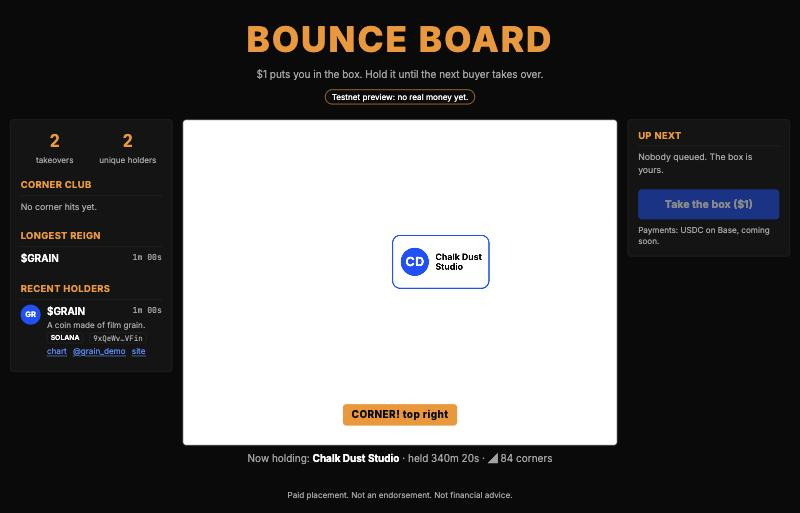

# Bounce Board

One box bounces around a white screen. $1 in USDC puts your name, brand or token in the box. You hold it until the next buyer in the queue takes over. Hit a corner and you join the Corner Club.

**Live (testnet, no real money yet):** https://bounce-board.colewendt6.workers.dev
**Static demo:** https://cwendt6.github.io/bounce-board/ (invented holders, no server)



## How it works

- **Same box for everyone.** Position is a pure function of the takeover's start time and seed, on a fixed 4:3 screen. The server only broadcasts takeovers, and every client computes the same path and the same corner hits. See [docs/architecture.md](docs/architecture.md).
- **Fair queue.** First paid, first shown. Each holder gets at least 60 seconds, plus 60 seconds of protection per corner hit.
- **Crypto first.** USDC on Base via [x402](https://www.x402.org/), so wallets, bots and AI agents can all take the box. Stablecoins only.

## Run locally

```bash
npm install
npm run dev          # page only, demo data: http://localhost:5173
npm run dev:worker   # page + Worker + Durable Object: http://localhost:8787
npm run build && npm test
npm run lint && npm run typecheck
```

## Deploy

```bash
npx wrangler login                                  # once
npm run build && npx wrangler deploy                # set CLOUDFLARE_ACCOUNT_ID in your env
```

For local testing, create `.dev.vars`:

```
DEV_FAKE_PAY=true
PAY_TO_ADDRESS=0xYourTestnetReceivingAddress
X402_NETWORK=eip155:84532
FACILITATOR_URL=https://x402.org/facilitator
```

With `DEV_FAKE_PAY=true`, `POST /api/dev/take` queues a takeover with no payment. The switch is off in every deployed environment.

## Roadmap

- [x] 1. Prototype: bouncing box, sidebars with demo data, deterministic position, preview deploy
- [ ] 2. Payments on testnet (Base Sepolia) via x402: queue, 60-second hold, corner detection, leaderboards
- [ ] 3. Moderation, token checks, admin panel, terms
- [ ] 4. Mainnet USDC and a public x402 `POST /take` endpoint with docs
- [ ] 5. Launch: domain, analytics, OG image, Base mini app
- [ ] 6. Optional: card payments for non-crypto brands

## Disclaimer

Listings are paid placements, not endorsements, and not financial advice.

## License

MIT
